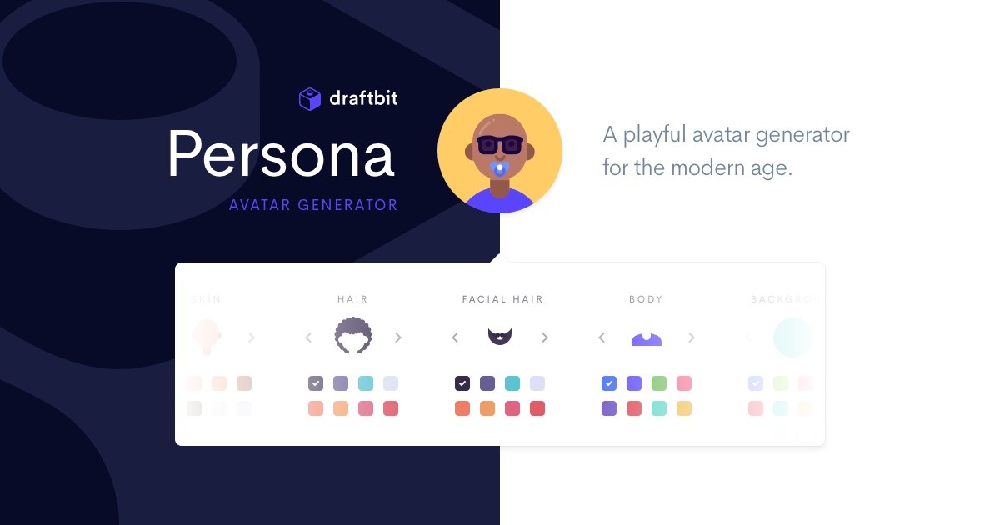

# Free Avatar Generator

## Contributing

Personas is built on GatsbyJS. Setup instructions are straight forward:

- `npm install -g bs-platform` installs reasonml
- `yarn && yarn develop` starts the gatsby server
- `yarn re:watch` starts the reasonml compiler

> Note that the first time you get set up you'll need to run `npx patch-package`
> to fix an error with one of `avatar-generator`'s dependencies.
